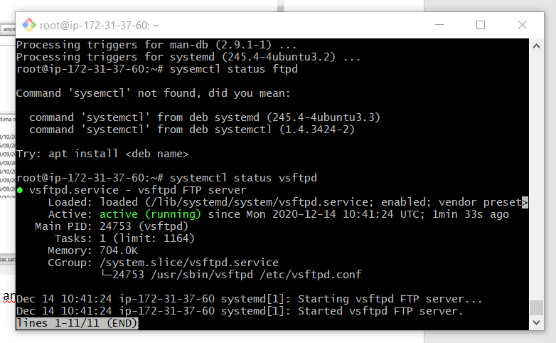

# Instancia
## En este documento realizado mediante markdump explicaré como crear una instancia en AWS.

# Ariketa 1
### Que es y para que sirve una instancia?
#### Una instancia es un servidor virtual en la nube, en este caso en la nube de Amazon. Se puede instalar y configurar un sistema operativo y aplicaciones en dicho sistema operativo.

Primero de todo tendremos que tener una cuenta creada y acceso a la consola de esa cuenta.

Clickaremos en "AW3 Console" y se nos abrirá el administrador de nuestro servidor.

El botón de lanzar instancias nos creará una instancia nueva, automaticamente nos redigirá a otra pestaña para completar la configuración de dicha instancia.

Seleccionaremos la opción de "Free tier only" para que nos aparezcan solamente las Amazon Machine Image que son gratuitas.

En mi caso seleccionaré el Ubuntu server 20.04 ya que es la ultima versión disponible.

Dejaremos el tipo de instancia por defecto (que es la unica gratuita en este caso) y clickaremos en "Review and Launch".

En mi caso cambiaré la capacidad del disco duro a 30 GB ya que es el maximo que nos ofrece gratuitamente esta instancia.

La pestaña de tags la dejaremos como está por defecto al menos que queramos añadir algún tipo de etiqueta a dicha instancia.

La configuración de ssh la dejaremos por defecto a no ser que hayamos cambiado la configuración del ssh por defecto.

En la siguiente pestaña, nos saldrán los datos de configuración que hemos seleccionado previamente, si queremos modificar algo, ahora es el momento de hacer algún cambio si es necesario.

Cuando clickemos en "Launch" nos saldrá la sigueinte pestaña en la que tendremos que crear una nueva clave.  
___IMPORTANTE: No podremos recuperar la clave una vez creada, tendremos que guardar el documento que descargaremos a continuación.___  

Cuando hayamos todos los pasos anteriores, tendremos que guardar la clave en una carpeta reconocible. En mi caso la he guardado en la carpeta de clase.  
Abriremos un nuevo GIT BASH y nos colocaremos en la carpeta donde se encuentra la clave.

Ejecutaremos el sigueinte comando para darle permisos al archivo.  

Y por ultimo ejecutaremos este otro comando:

Una vez realizados estos pasos, la instancia debería estar operativa.

# Ariketa 2 Documentación Instalaciones  
## Apache2  
  
Para llegar a este paso primero necesitamos este otro  
.png)  
Hay que añadir la linea de http.  

## MySQL

Solamente hay que instalar normalmente y comprobar su status.

## PHP

Solamente hay que instalar normalmente y comprobar su status.

## VSFTPD

Solamente hay que instalar normalmente y comprobar su status.

# Ariketa 3  
## ¿Qué es y para qué sirve una IP Elástica?  
Las direcciones IP elásticas son direcciones IPv4 estáticas diseñadas para la informática en la nube. Con una dirección IP elástica, puede enmascarar los errores de una instancia o software volviendo a mapear rápidamente la dirección a otra instancia de su cuenta. 

## Imagen de cómo has asociado la IP elástica a tu instancia.  

Como podemos observar, la ip elastica se ha asociado correctamente a nuestra instancia.  

Podemos comprobar en la misma instancia que se ha asociado correctamente.

# Ariketa 4  
## ¿Que es y para que sirve DNS?  
El Sistema de Nombres de Dominio o DNS es un sistema de nomenclatura jerárquico que se ocupa de la administración del espacio de nombres de dominio (Domain Name Space). Su labor primordial consiste en resolver las peticiones de asignación de nombres.  

## Indica cuales son y para qué se usan los diferentes tipos de registros DNS.  

-__A__ = Dirección (address). Este registro se usa para traducir nombres de servidores de alojamiento a direcciones IPv4.  

-__AAAA__ = Dirección (address). Este registro se usa en IPv6 para traducir nombres de hosts a direcciones IPv6. 

-__CNAME__ = Nombre canónico (canonical Name). Se usa para crear nombres de servidores de alojamiento adicionales, o alias, para los servidores de alojamiento de un dominio. Es usado cuando hay muchos servicios en ejecución. 

-__NS__ = Servidor de nombres (name server). Define la asociación que existe entre un nombre de dominio y los servidores de nombres que almacenan la información de dicho dominio.  

-__MX__ = Intercambio de correo (mail exchange). Asocia un nombre de dominio a una lista de servidores de intercambio de correo para ese dominio. Tiene un balanceo de carga y prioridad para el uso de uno o más servicios de correo.  

-__PTR__ = Indicador (pointer). También conocido como 'registro inverso', funciona a la inversa del registro A, traduciendo IPs en nombres de dominio. Se usa en el archivo de configuración de la zona DNS inversa.    

-__SOA__ = Autoridad de la zona (start of authority). Proporciona información sobre el servidor DNS primario de la zona.  

-__SRV__ = Service record (SRV record).  

-__TXT__ =  permite anotar un texto libre y se usa para múltiples aplicaciones, pero la mas común es la del correo electrónico.

## Imagen los registros DNS de tu sitio en Guebs y explicación de los registros de tu dominio grupoX.zerbitzaria.net.  

1.- El registro __A__ nos muestra la direccion ip de nuestro servidor.  
2.- El registro __MX__ nos muestra el correo de destino de nuestro servidor.  
3.- El resgistro __TXT__ no se lo que hace.  

# Ariketa 5  

## ¿Cuántos servidores DNS existen?  
Hay 13 diferentes servidores DNS asignado cada uno a un operador diferente, por ejemplo: Verisign, Universidad de Maryland, NASA...

## ¿Cuántas redirecciones DNS son posibles?  
Todas las necesarias hasta encontrar la direccion DNS deseada.

## ¿Qué son los servidores DNS Raíz?  
Representan el primer eslabón de la traducción de los nombres de dominio en direcciones IP que es necesario llevar a cabo para hacer posible la comunicación entre los nodos o servidores de Internet.

## ¿Para qué montar un servidor si simplemente escribiendo en un fichero la relación IP/Nombre el sistema ya funcionaría?  
Creando un servidor, tienes acceso a muchas mas funcionalidades como por ejemplo, subir una página web a dsicho servidor o control de acceso de usuarios. Los accesos, recursos y la integridad de los datos son controlados por el servidor de forma que un programa cliente defectuoso o no autorizado no pueda dañar el sistema.

## ¿Es posible si dispones de una conexión a Internet con IP dinámica ofrecer servicios en Internet? Es decir, si quieres ofrecer los servicios SND, no dispones de IP estática, esto es, cada vez que te conectas a Internet tu IP, aunque a veces sea la misma, no siempre es la misma.   
Es posuble ofrecer servicios a internet si tienes una ip dinamica pero nuestro proveedor de servicios va a asignarnos una dirección variable. Hay que tener en cuenta que esto hace que la conexión sea menos estable y podamos tener ciertos problemas.

## Según lo expuesto, y si en tu configuración de red del sistema operativo solamente posees un servidor DNS, entonces: ¿cuál sería el proceso para encontrar la IP de la dirección web: http://www.debian.org/distrib/netinst?
Primero hace la llamada al servidor org. Este servidor te devuelve debian.org. Después, se hace la llamda a debian para conseguir su IP. Finalmenete, recibimos el resultado de la consulta.

## ¿Que es ICANN?  
Es la empresa responsable de asignar espacio de direcciones numéricas de protocolo de Internet (IP), identificadores de protocolo y de las funciones de gestión del sistema de nombres de dominio de primer nivel genéricos (gTLD) y de códigos de países (ccTLD), así como de la administración del sistema de servidores raíz.